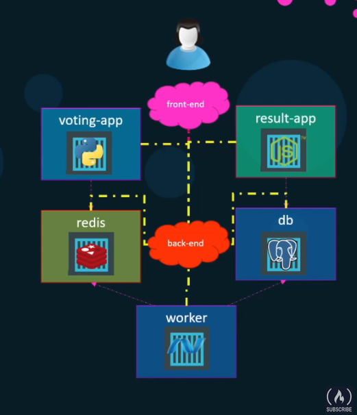

# Docker Tutorial

See:
* [Docker Tutorial for Beginners](https://www.youtube.com/watch?v=fqMOX6JJhGo) by FreeCodeCamp on YouTube
* [Docker labs](https://kodekloud.com/p/docker-labs)

Contents:
- [Docker Tutorial](#docker-tutorial)
  - [Notes](#notes)
    - [Image names](#image-names)
    - [Expose vs Port mapping/publishing](#expose-vs-port-mappingpublishing)
  - [Topics](#topics)
    - [Container inspection](#container-inspection)
    - [Networks](#networks)
    - [Storage / Volume mapping](#storage--volume-mapping)
    - [Docker compose](#docker-compose)
    - [Docker registry](#docker-registry)
    - [Docker Engine](#docker-engine)
    - [Host resources](#host-resources)
    - [Container orchastration](#container-orchastration)
  - [Examples](#examples)
    - [Dockerize a Flask App (!)](#dockerize-a-flask-app-)
    - [Sample Docker Stack (docker compose)](#sample-docker-stack-docker-compose)
    - [Deploy a Private Container Registry (and manage images)](#deploy-a-private-container-registry-and-manage-images)
    - [Run minecraft server](#run-minecraft-server)
  - [Commands](#commands)


## Notes

### Image names

Image name standard: `username/image_name:tag_name`
* Username: The user/account or organisation. Default: same as image_name when left blank.
* Image name: The name or the image/repository.
* Tag: The version number. Standards are described on the Docker website.

e.g. `nginx/nginx`

Change image name and registry with:
* `docker image tag my-image <username>/<image-name>:<tag-name>`
* `docker image tag my-image <registry-url>/<username>/<image-name>:<tag-name>`

Rename image example: `docker image tag my-image localhost:5000/plasmatech8/test-image:2`

Create image from a container example: `docker commmit container-name image-name`

### Expose vs Port mapping/publishing

`EXPOSE <port>`:
* Allows the host to access via `<container-ip>:<port>`
* Allows other containers to access too

`-p <host-port>:<container-port>`
* Maps/publishes a port from a container to the host machine (localhost).

## Topics

### Container inspection

Use `docker inspect <container-name>` to view important details.

We can see:
* Environment variables
* IP address (accessible by docker network or host machine) (`grep "IPAddress"`)
* Mac address
* Port bindings (from containerhost:port to localhost:port)
* Exposed ports (from containerhost:port to containerIP:port)
* Docker Network
* ...

### Networks

By default containers are in the `bridge` network (idk what is so special about it).

Networks are important so that we can isolate or group multiple running instances with a host.

If you set `--network host`:
* The **container localhost** will be the same as the **host localhost**.
* Can access a web application **without** needing to expose any ports or do port-mappings

If you set `--network none`:
* All containers will be isolated

A container can access another container on the same network using IP address, or container-name.

Container-name is best-practice. Docker has a built-in DNS for container names.

 e.g.
```python
import docker
import mysql.connector

client = docker.DockerClient()
container = client.containers.get("magical_meitner")
ip_addr = container.attrs['NetworkSettings']['IPAddress']

mydb = mysql.connector.connect(ip_addr)
# OR
mydb = mysql.connector.connect("magical_meitner") # if part of the same docker network

```

To try out using network hostnames (container-names for network address):
1. Creating a new network (not bride) and create servers:
```bash
docker network create my-network

docker run -it --name foo --network my-network ubuntu
docker run -it --name bar --network my-network ubuntu
```
2. Install and run a ping
```bash
apt update -y
apt install iputils-ping -y

ping foo
```

### Storage / Volume mapping

Use `-v` or `--mount` flag to mount local folder to the container. (`-v` is old-style)

Commands:
* `docker run -v <host-directory>:<container-directory> <container-name>`
  * Autocreates the volume or directory.
* `docker run --mount type=bind,source=<host-directory>,target=<container-directory> <container-name>`
  * Must create the volume or directory first!!!
* (can also mount docker-volumes)

e.g.
* `docker run -itv $(pwd)/stuff:/stuff ubuntu`
* `docker run -it --mount type=bind,source=$(pwd)/stuff,target=/stuff ubuntu`

The `--mount` command is more modern.

### Docker compose

Used to run multiple containers on a single docker host.

`docker-compose up` with this `docker-compose.yml` example:

Docker compose comes in version 1/2/3. Version 3 is best. See below.

### Docker registry

Default registry: DockerHub (docker.io)

Other registries:
* gcr.io
* Private registries

You log into another registry using: `docker login private-registry.io`

You can manage images with a private registry with commands:
* Rename image: `docker image tag my-image localhost:5000/plasmatech8/test-image`
* Push image: `docker push localhost:5000/plasmatech8/test-image`
* View images in a registry: `curl -X GET localhost:5000/v2/_catalog`
* View image tags/versions: `curl -X GET localhost:5000/v2/plasmatech8/test-image/tags/list`

See example below.

### Docker Engine

The docker engine is the local machine.

We can change the engine to a foreign machine using: `docker -H=<remote-url>`

### Host resources

cgroups: By default, there is no restriction on how much CPU/memory resources a container can draw from the host

We can change the number of cpu cores used memory using flags:
* `--cpus=.5` for the % of host resources
* `--memory=100m` for the megabytes of RAM

### Container orchastration

Used to run containers over multiple nodes.

Solutions:
* Docker Swarm - easy to setup, not so configurable, lacks scaling capabilities compared to others
* Kubernetes - VERY popular, harder to setup, very configurable, supported by all cloud providers
* Apache Mesos - difficult to setup and get started, supports many advanced features

Docker Swarm:
* Have 1 swarm manager node, and many worker nodes with Docker installed.
* Init: `docker swarm init --advertise-addr <IP>` to create manager node
* Join: `docker swarm join --token <token> <HOST:PORT>` to add worker node
* On manager node, use `docker service create --replicas=3 my-web-server` to scale a container (has similar options as `docker run`)

Kubernetes:
* Contains a cluster of 1 master node, and many worker nodes.
* Components
  * API server - API
  * etcd - decentralised information storage, including logs between multiple master nodes
  * Scheduler - distributes work
  * Controller - noticing and responding to when a container goes down
  * Container runtime - container software
  * Kubelet - used to ensure containers are running on the current node
* Run: `kubectl run my-web-server --image=web-server --replicas=1000`
* Scale: `kubectl scale --replicas=2000 my-web-server`
* Updates: `kubectl rolling-update my-web-server --image=web-server:2`
* Rollback: `kubectl rolling-update my-web-server --rollback`
* Get nodes: `kubectl get nodes`
* Cluster info: `kubectl cluster-info`

## Examples

### Dockerize a Flask App (!)

Summary:
* Flask app with on `0.0.0.0:8080`
* Port mapped from `(container):8080` to `localhost:5000`
* Container port also exposed on `containerIP:8080`

`flask_app/` contains a basic flask application which relies on an `APP_COLOR` environment variable.
* We need to ensure that we have exposed `0.0.0.0` in our container
* We can access the website via `<CONTAINER-IP-ADDRESS>:<CONTAINER-PORT>` (shown in the stdout via flask)
* Or `localhost:<LOCAL-PORT>` if we using port mapping`-p <LOCAL-PORT>:<CONTAINER-PORT>`

```
docker build . -t my-flask-app
docker run -itp 5000:8080 -e APP_COLOR=blue my-flask-app
```

### Sample Docker Stack (docker compose)




```yml
version: 3 # docker-compose.yml version

services:
  redis:
      image: redis
      networks:
        - back-end
  db:
      image: postgres:9.4
      networks:
        - back-end
  vote:
      image: voting-app # Or ./vote for a directory
      ports:
          - 5000:80
      networks:
        - front-end
        - back-end
  result:
      image: result-app
      ports:
          - 5001:80
      networks:
        - front-end
        - back-end
  worker:
      image: worker
      networks:
        - back-end

networks:
  front-end:
  back-end:
```

This is similar to:
```
docker network create front-end
docker network create back-end

docker run -d --name=redis  --network back-end              redis
docker run -d --name=db     --network back-end              postgres:9.4
docker run -d --name=vote   --network back-end  -p 5000:80  voting-app
docker run -d --name=result --network back-end  -p 5001:80  result-app
docker run -d --name=worker --network back-end              worker

docker network connect front-end voting-app
docker network connect front-end result-app
```

NOTE: `--link` IS BEING DEPRICATED IN FAVOUR OF NETWORKS (OR DOCKER SWARM / KUBERNETES).
`docker run --link <host-name>:<container-name>` can be used to link two containers together by
adding hostnames to the started container.

If we have specified `host="redis"` in our code, then we will be able to access
it by name (in the same way as `localhost`).

### Deploy a Private Container Registry (and manage images)

Below shows how to:
* Deploy our own private registry
* Push/pull an image
* View images and tags

```bash
# Deploy a docker registry image
docker run -d -p 5000:5000 --name registry registry

# (Create a new image for testing purpose)
docker run -d --name test-container ubuntu sleep 5
docker commit test-container localhost:5000/plasmatech8/test-image

# Push and pull a docker image
docker push localhost:5000/plasmatech8/test-image
docker pull localhost:5000/plasmatech8/test-image

# View all images in your registry
curl -X GET localhost:5000/v2/_catalog

# View tags/versions of an image
curl -X GET localhost:5000/v2/plasmatech8/test-image/tags/list
```

Alternatively, you can do everything in a docker GUI (like the VSCode Docker extension).

Note:
* Commit command create an image which runs the command passed in (`sleep 5`)
* `docker run -d --name test-container ubuntu /bin/bash -c "echo start && sleep 2 && echo mid && sleep 8 && echo end"`

### Run minecraft server

```bash
docker run -it -p 25565:25565 -e EULA=TRUE itzg/minecraft-server:2021.12.0-java16
```
And we can test out different CPU/memory configs using `--cpus` and `--memory`
```bash
docker run -it --rm -p 25565:25565 -e EULA=TRUE --cpus 2 itzg/minecraft-server:2021.12.0-java16
docker run -it --rm -p 25565:25565 -e EULA=TRUE --cpus 1 itzg/minecraft-server:2021.12.0-java16 # SLOW STARTUP

docker run -it --rm -p 25565:25565 -e EULA=TRUE --memory 500m itzg/minecraft-server:2021.12.0-java16
docker run -it --rm -p 25565:25565 -e EULA=TRUE --memory 200m itzg/minecraft-server:2021.12.0-java16 # SLOW STARTUP
```

## Commands

(In addition to the 01 commands)

Container registry:
Purpose                 | Command/s
------------------------|------------------------
Log into a registry     | `docker login <registry-url>`
View images in registry | `curl -X GET <registry-url>/v2/_catalog`
View tags for image     | `curl -X GET <registry-url>/v2/<image-name>/tags/list`

Image management:

Purpose                 | Command/s
------------------------|------------------------
Rename an image         | `docker image tag <old-image-name> <new-image-name>`
.                       | New image name can be in form of: `<registry-url>/<username>/<image-name>:<tag-name>`

Container management:

Purpose                 | Command/s
------------------------|------------------------
Inspect an container    | `docker inspect <container-name>`
Run an image (ext)      | `docker run ...`
.                       | `-v <source-dir>:<container-dir>` - autocreates volumes/directories
.                       | `--mount type=bind,source=<source-dir>,target=<container-dir>` - volumes must preexist
.                       | `--cpus <percentage>` e.g. .5 half of one CPU
.                       | `--memory <number>` e.g. 100m megabytes

Other/Orchestration:

Purpose                 | Command/s
------------------------|------------------------
Change docker engine    | `docker -H=<remote-url>`
Run docker compose      | `docker-compose up .`
Resource usage/stats    | `docker stats` (COOL!)

